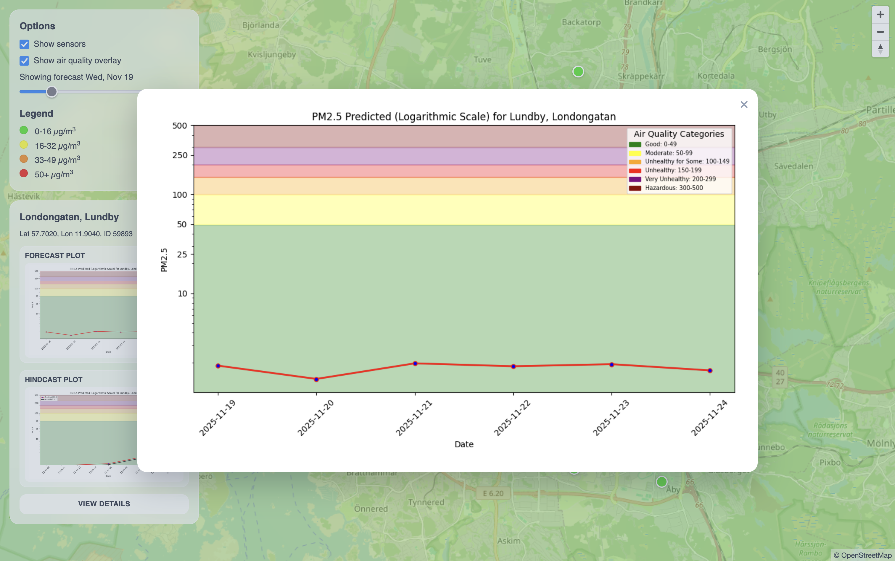
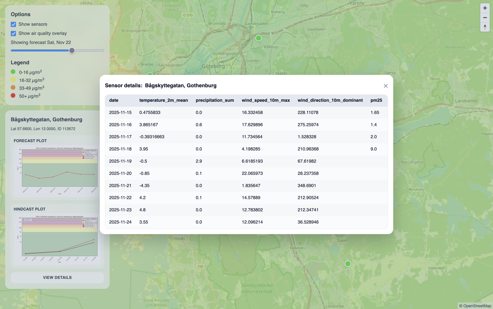

# PM<sub>2.5</sub> Forecast


Daily PM<sub>2.5</sub> forecasts for Gothenburg-area sensors, combining AQICN observations and Open‑Meteo weather features with per‑sensor XGBoost models.

- Sensor data: https://aqicn.info
- Weather forecasts: https://open-meteo.com

## Setup

### Local Development

For local development and testing:

1. Copy `.env.example` to `.env`.
2. Fill the required api keys:
   - `HOPSWORKS_API_KEY` lets the notebooks authenticate with your Hopsworks project.
   - `AQICN_API_KEY` used to pull per-station PM2.5 readings from AQICN.
   - `SENSOR_CSV_FILE` to run a single sensor (optional)

3. **Initial run**: execute notebooks `1_backfill.ipynb` -> `4_batch_inference.ipynb` in order so each stage produces the artifacts that the static site consumes.
2. **Local preview**: from the repo root, start any static server (e.g. `python -m http.server 8080`).

### Remote Deployment

1. **Modal setup**: 
   - Create a project with all required environment variables:
     - `HOPSWORKS_API_KEY`: for Hopsworks authentication
     - `AQICN_API_KEY`, `AQICN_COUNTRY`, `AQICN_CITY`, `AQICN_STREET`, `AQICN_URL`: AQICN API
     - `GITHUB_PAT`: GitHub Personal Access Token for pushing results to the repository
   - Deploy the pipeline using `uv run modal deploy main.py`. Modal will run notebooks 2 and 4 daily, generate images and automatically push them to GitHub.
2. **Static hosting**: Deploy the static frontend files (`index.html`, `main.js`, `styles.css`) and the `models/` to Vercel or GitHub Pages.

## Notebook Guide

Run the notebooks sequentially (`1_backfill` -> `4_batch_inference`) the first time you set up the project so each stage has the artifacts it needs. After that initial pass, the scheduled automation only has to refresh the feature pipeline (notebook 2) and rerun batch inference (notebook 4).

### `1_backfill.ipynb` Raw feeds -> Feature Store
1. Logs into Hopsworks and fetches the master list of sensors (one secret per sensor containing city/street/coords). If SENSOR_CSV_FILE is defined inside `.env`, it will only go through the specified sensor.
2. For each sensor:
   - Calls AQICN’s REST API (using the configured API key) to retrieve the latest PM2.5 measurement.
   - Calls Open-Meteo’s API for hourly forecasts, then samples around 12:00 to build a daily weather feature.
3. Normalizes timestamps , sets `sensor_id`, city, street, lat/lon columns to match the feature group schemas.
4. Writes the AQI rows to `air_quality_all` and the weather rows to `weather_all` using Hopsworks Feature Store client.

### `2_feature_pipeline.ipynb` Feature Engineering
1. Again logs into Hopsworks and loads secrets; optionally lets you run per-sensor or batch mode (depending on `.env`).
2. Reads the latest AQI entries (today) plus 4 days of history from `air_quality_all` for additional features.
3. Runs helper functions from `utils.airquality` to add:
   - Rolling 3-day averages (`pm25_rolling_3d`)
   - 1–3 day lags (`pm25_lag_1d/2d/3d`)
   - Neighbor-based averages (using lat/lon distance to other sensors)
4. Inserts the enriched AQI and weather rows back into the feature store, effectively making feature pipeline tables available for the next steps.


### `3_training.ipynb` Model Training + Registry
1. Reads the enriched features from the feature store (via feature views) for each sensor ID.
2. Trains an `XGBRegressor` per sensor, using the all different feature set produced above (rolling, lags, nearby averages, weather) and combinations.
3. Measures the R^2 and MSE across all models and selects the model with the highest R^2.
4. Saves the best model artifacts to `models/<sensor_id>/` (`model.json`, feature-importance plots, hindcast during training).
5. Registers each model in the Hopsworks Model Registry under `air_quality_xgboost_model_<sensor_id>`, storing metadata like:
   - Feature order (so inference can reindex columns correctly)
   - Version number and creation timestamp
   - Links to the artifact directory (PNG plots, etc.)
6. Because every model lives in the registry, the inference notebook can just call `mr.get_models(name)` and always fetch the latest.

### `4_batch_inference.ipynb` Forecast Generation + Monitoring
1. Loads weather + AQI feature groups (covering recent past + upcoming days) and merges them, sorted by sensor/date.
2. For each `target_day` that lacks a real PM2.5 reading:
   - Loads the per-sensor model from the registry (cached so we only call download once per sensor).
   - Reindexes the feature row based on the model's feature metadata and predicts `predicted_pm25`.
   - Fills `days_before_forecast_day` to capture the lead time (e.g., D+1, D+2…).
   - Recomputes the additional features including the predicted value, ensuring the auto-regressive loop remains consistent.
3. Exports artifacts:
   - `models/predictions.csv` (used by the frontend)
   - Forecast plot per sensor
   - IDW interpolation overlays for each horizon.
4. Inserts the new predictions into the monitoring feature group `aq_predictions`, enabling hindcast evaluation and dashboards.
5. Uploads forecast/hindcast/interpolation images to Hopsworks Datasets (`Resources/airquality/...`) so they’re centrally stored and accessible.
6. Hindcast section merges D+1 predictions with actual outcomes from `air_quality_all`.

### `5_function_calling.ipynb` LLM EVALUATION
1. Spins up LangChain/OpenAI clients and a lightweight retrieval layer so LLMs can fetch station context (city, sensor metadata, last predictions) before answering.

## Project Structure

```
pm25-forecast-openmeteo-aqicn/
├─ notebooks/
│  ├─ 1_data_ingestion.ipynb          Fetch raw AQI + weather snapshots
│  ├─ 2_feature_pipeline.ipynb        Build & insert additional features
│  ├─ 3_training.ipynb                Train per-sensor XGBoost models
│  └─ 4_batch_inference.ipynb         Run daily batch forecasts + heatmaps
├─ models/                            Per-sensor artifacts (plots, model.json)
├─ utils/airquality.py                Shared feature engineering + plotting
├─ main.py                            Modal deployment script for remote execution
└─ main.js / index.html / styles.css  Static MapLibre frontend
```

## Screenshots





